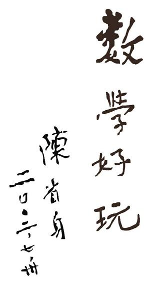

Back to [**homepage**](https://wanminliu.github.io)

Back to [**University teaching**](https://wanminliu.github.io/uni/)

------

_Detta är min hemsida för matematikundervisning i skolan._

[CV](https://wanminliu.github.io/gymnasium/CV_Wanmin_Liu_26gySV.pdf)

Jag är legitimerad lärare i matematik för årskurs 7–9 och gymnasieskolan och har en doktorsexamen i matematik. Här samlar jag material från min matematikundervisning, egna undervisningsartiklar och andra texter om matematik och matematikdidaktik.

        
     <q><B>數學好玩</B></q> <a href="https://zh.wikipedia.org/wiki/%E9%99%88%E7%9C%81%E8%BA%AB"><em>陳省身</em></a> 二〇〇二 七卅   
<q><B>Math is fun</B></q> <a href="https://en.wikipedia.org/wiki/Shiing-Shen_Chern"><em>Shiing-Shen Chern</em></a> 20020730    

## Undervisningserfarenhet

### [Anna Whitlocks gymnasium](https://annawhitlocksgymnasium.stockholm/), _september–november 2025_, Stockholm

* Matematik 1b, Matematik 3c, Matematik 5 (två vikarierande lektioner).

### [Ekens skola, 7–9](https://grundskola.stockholm/hitta-grundskola/grundskola/ekens-skola), _mars–maj 2025_, Stockholm

* Matematik, årskurs 7 och 8.

### [Kärrtorps gymnasium](https://karrtorpsgymnasium.stockholm/), _mars–maj 2024_, Stockholm

* Matematik 1a, Matematik 1b, Matematik 3c (individuell undervisning) och Matematik 5 (en vikarierande lektion).

>_Ett särskilt tack till Kambiz Kafi, som har varit en viktig inspirationskälla i min matematikundervisning på gymnasiet._

## Matematikdidaktik och undervisningsartiklar

  - [Varför ger en seger tre poäng – Matematiken bakom fotbollens poängsystem](https://wanminliu.wordpress.com/2026/06/25/varfor-ger-en-seger-tre-poang-matematiken-bakom-fotbollstabellen/), [PDF](https://wanminliu.github.io/gymnasium/VM.pdf), 25 juni 2026. 
  - Vad händer om repet runt jordens midja blir en meter längre? 
    - [Del 1. Det jämna lyftet: omkretsens linjäritet](https://wanminliu.github.io/gymnasium/Jordensmidja1.pdf), 20 aug. 2026.
    - [Del 2. Enpunktslyftet: tangentmodellen och det icke-linjära sambandet](https://wanminliu.github.io/gymnasium/Jordensmidja2.pdf), 20 aug. 2026.
    - [Del 3. Från enpunktslyft till jämnt lyft: en resa mellan modeller](https://wanminliu.github.io/gymnasium/Jordensmidja3.pdf), 20 aug. 2026.
  - [Utforskande och heuristiskt lärande i algebra på gymnasiet](https://urn.kb.se/resolve?urn=urn:nbn:se:su:diva-252970), [PDF](https://www.diva-portal.org/smash/get/diva2:2042679/FULLTEXT01.pdf), 3 mars 2026.
  - [Gruppregler för att lösa uppgifter på tavlan](https://wanminliu.github.io/gymnasium/Gruppregler.pdf), 10 okt 2025.
  - [Areaformel för regelbunden femhörning -- ett elementärt bevis](https://wanminliu.github.io/gymnasium/PythagorasArea.html), 13 feb 2025.
  - [ODE, SageMath and General AI -- An Example from High School Teaching](https://wanminliu.github.io/gymnasium/ODE_SageMath_AI.html), juni 2024.
  - [Pythagoras sats](https://wanminliu.github.io/gymnasium/Pythagoras_sats.html), 10 feb 2024.

## Undervisningsmaterial

### Matematik 1
  - [Vad är summan av de första n positiva udda talen II](https://wanminliu.github.io/gymnasium/Ma1b_summan_udda_talen2.pdf), 24 nov. 2025.  [Blogg](https://wanminliu.wordpress.com/2025/11/24/vad-ar-summan-av-de-forsta-n-positiva-udda-talen-ii/)
  - [Linjensekvationblad, Ma1b](https://wanminliu.github.io/gymnasium/Ma1b_linjensekvationblad.pdf), 20 nov. 2025. 
  - [Linjens ekvation, Ma1b](https://wanminliu.github.io/gymnasium/Ma1b_linjensekvation.pdf), 14 nov. 2025. 
  - [Koordinatsystem, Ma1b](https://wanminliu.github.io/gymnasium/Ma1b_koordinatsystem.pdf), 6 nov. 2025. [Koordinater blad, Ma1b](https://wanminliu.github.io/gymnasium/Ma1b_koordinaterblad.pdf)
  - [Avstämning 1 - potens och algebra](https://wanminliu.github.io/gymnasium/Ma1b-potens-algebra_HT25.pdf), 17 okt. 2025. 
  - [Problemlösning, Ma1b](https://wanminliu.github.io/gymnasium/20251009Ma1b-Problem.pdf), 9 okt. 2025. 
  - [PEDMAS – hemlig kod för räkneordning](https://wanminliu.wordpress.com/2025/09/19/pedmas-hemlig-kod-for-rakneordning/), 19 sept 2025. 
  - [Vad är summan av de första n positiva udda talen I](https://wanminliu.github.io/gymnasium/Ma1b_summan_udda_talen1.pdf), 16 sept 2025. [Blogg](https://wanminliu.wordpress.com/2025/09/19/vad-ar-summan-av-de-forsta-n-positiva-udda-talen/)
  - [Grafer och funktioner](https://wanminliu.github.io/gymnasium/Funktioner.html), 3 maj 2024.
  - [Förändringsfaktor och index](https://wanminliu.github.io/gymnasium/FF.html), 25 apr. 2024.

### Matematik 2
  - [Andragradsekvation, Ma2b](https://wanminliu.github.io/gymnasium/Ma2b_Andragradsekvation.pdf), 5 nov. 2025. [Utdelningsblad till elev](https://wanminliu.github.io/gymnasium/Ma2b_AndragradsekvationElev.pdf).

### Matematik 3
  - [Trigonometri III, Ma3c](https://wanminliu.github.io/gymnasium/Ma3c_Trigonometri3.pdf), 24 och 27 nov. 2025. 
  - [Trigonometri II, Ma3c](https://wanminliu.github.io/gymnasium/Ma3c_Trigonometri2.pdf), 24 och 27 nov. 2025. 
  - [Trigonometri I, Ma3c](https://wanminliu.github.io/gymnasium/Ma3c_Trigonometri.pdf), 20 nov. 2025. [Enhetscirkeln blad, Ma3c](https://wanminliu.github.io/gymnasium/Ma3c_Enhetscirkelnblad.pdf)
  - [Extremvärdesproblem, Ma3c](https://wanminliu.github.io/gymnasium/Ma3c_Extremproblem.pdf), 23 okt. 2025. [Utdelningsblad till elev](https://wanminliu.github.io/gymnasium/Ma3c_ExtremproblemE.pdf). 
  - [Tillämpningar av derivatan](https://wanminliu.github.io/gymnasium/Derivatan_P.pdf), 6 okt. 2025. [Utdelningsblad till elev](https://wanminliu.github.io/gymnasium/Derivatan2Elev.pdf) och [Anteckningar](https://wanminliu.github.io/gymnasium/Derivatan_F.pdf)
  - [Exponentialfunktioner och deras derivator](https://wanminliu.github.io/gymnasium/Exp.pdf), 2 okt. 2025. [Utdelningsblad till elev](https://wanminliu.github.io/gymnasium/ExpElev.pdf) och [Anteckningar](https://wanminliu.github.io/gymnasium/Exponentialfunktioner.pdf)
  - [En intressant ekvation om rationella funktioner](https://wanminliu.wordpress.com/2025/09/24/en-intressant-ekvation-om-rationella-funktioner/), 2 okt. 2025. 

### Matematik 5
  - [Talteori, Ma5](https://wanminliu.github.io/gymnasium/Ma5_talteori.pdf), 17 nov. 2025. 

### Årskurs 7–8 
  - [Pythagoras sats](https://wanminliu.github.io/gymnasium/Pythagoras.pdf), 23 maj 2025.
  - [Pythagoras sats: elevers affischer](https://wanminliu.wordpress.com/2025/06/16/pythagoras-sats/), 20 maj 2025.
  - [Statistik och sannolikhet, nivå A](https://wanminliu.github.io/gymnasium/ssa/Statistik_Sannolikhet_N4.html), 8 maj 2025.
  - [Statistik och sannolikhet: kasta två tärningar](https://wanminliu.github.io/gymnasium/ssa/Statistik_Sannolikhet_N42.pdf), 8 maj 2025.
  - [Statistik och sannolikhet, nivå E](https://wanminliu.github.io/gymnasium/sse/Statistik_Sannolikhet_N1.html), 7 maj 2025.

## Övriga aktiviteter

### [Kleindagarna, juni 2024](https://www.mittag-leffler.se/activities/kleindagarna-ii/) 
* [Om Kleindagarna](https://www.kleindagarna.se/)

### Affischer
  - [Pi-dagen 2026](https://wanminliu.github.io/gymnasium/Pi-dagen2026.html), mars 2026.
  - [Pi-dagen 2025](https://wanminliu.github.io/gymnasium/Pi-dagen2025.html), mars 2025.
  - [Pi-dagen 2024](https://wanminliu.github.io/gymnasium/Pi-dagen2024.html) (med Kambiz Kafi), mars 2024.

## [Undervisningsblogg](https://wanminliu.wordpress.com/category/teaching/)

## Externa resurser

- [Math Is Fun](https://www.mathsisfun.com/) – matematiska förklaringar och övningar.

  

  

Last update on {{ site.time | date_to_long_string }}.

